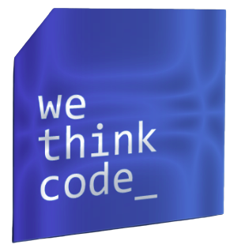

# 👩‍💻 **`MurexTheCoder`**

I'm a WeThinkCode software Engineering graduate, honored with a fellowship award for embodying the spirit of the WeThinkCode_ community through my contributions to the Durban campus. My dedication to assisting my peers by explaining complex concepts through live workshops and video content shared on Slack led to the creation of my YouTube channel, extending my educational reach globally. I'm a self-motivated developer committed to continuous learning and upskilling.

       
       

---

🎓 Education

Qualification: MICT SETA Accredited National Certificate - Information Technologies - NQF level 5 in System Development

---

     
